# Assignment on Module 5: GitHub Actions Fundamentals

## Project Title

Automating React Application Testing and Build Process Using GitHub Actions CI Pipeline with AWS EC2 Self-hosted Runner

---

## Repository Link

GitHub Repository:  
https://github.com/shefat-global/devops-b11-m5-github-actions-fundamentals-ci-cd

Branch used for CI pipeline:

```text
development
```

---

## Problem Statement

A software company wants to automate the testing and build process of their React application. Previously, developers manually tested and built the project before deployment. This manual process takes time and can introduce human errors.

To solve this problem, I created a CI pipeline using GitHub Actions. The workflow runs automatically whenever code is pushed to the `development` branch. Instead of using a GitHub-hosted runner, I configured an AWS EC2 Ubuntu instance as a self-hosted runner.

---

## Objectives

The main objectives of this assignment are:

- Understand CI/CD basics and benefits
- Understand GitHub Actions architecture
- Create a GitHub Actions workflow
- Use jobs, steps, and runners
- Write a YAML workflow file
- Configure and use a self-hosted runner
- Debug pipeline failures from workflow logs
- Successfully build a React application using GitHub Actions

---

## Tools and Technologies Used

- GitHub
- GitHub Actions
- AWS EC2
- Ubuntu
- Self-hosted Runner
- React.js
- Node.js
- npm
- YAML

---

## What is CI/CD?

CI/CD means Continuous Integration and Continuous Delivery or Continuous Deployment.

Continuous Integration is the process of automatically testing and building code whenever developers push changes to a repository. It helps developers find errors early and improves the quality of the application.

Continuous Delivery or Deployment is the process of preparing or releasing the application automatically after successful testing and building.

In this assignment, I implemented the CI part. The React application is automatically tested and built when code is pushed to the `development` branch.

### Benefits of CI/CD

- Reduces manual work
- Saves development time
- Finds errors early
- Improves code quality
- Makes the build process reliable
- Reduces human mistakes

---

## What is GitHub Actions?

GitHub Actions is an automation platform provided by GitHub. It allows developers to automate software development workflows such as testing, building, and deployment.

A GitHub Actions workflow is written in a YAML file and stored inside the repository under:

```text
.github/workflows/
```

For this assignment, the workflow file is:

```text
.github/workflows/react-ci.yml
```

---

## What is a Self-hosted Runner?

A runner is a machine that executes the jobs defined in a GitHub Actions workflow.

There are two types of runners:

1. GitHub-hosted runner
2. Self-hosted runner

A GitHub-hosted runner is managed by GitHub. A self-hosted runner is managed by the user.

In this assignment, I used an AWS EC2 Ubuntu instance as a self-hosted runner. The EC2 instance was connected to my GitHub repository and executed the pipeline jobs.

---

## Self-hosted Runner Setup Summary

The self-hosted runner was configured from:

```text
GitHub Repository → Settings → Actions → Runners → New self-hosted runner
```

The runner was downloaded and configured on the EC2 instance. After successful configuration, the runner was added to the repository and became available for workflow execution.

The runner was also installed as a service so that it can keep running even after closing the SSH session.

Example service commands used:

```bash
cd ~/actions-runner
sudo ./svc.sh install
sudo ./svc.sh start
sudo ./svc.sh status
```

When the runner service is active, it shows:

```text
Active: active (running)
```

---

## Workflow Execution Process

The workflow execution process is:

1. Developer pushes code to the `development` branch.
2. GitHub Actions detects the push event.
3. GitHub reads the workflow YAML file from `.github/workflows/react-ci.yml`.
4. The job is assigned to the AWS EC2 self-hosted runner.
5. The runner checks out the repository code.
6. Node.js is configured.
7. Project dependencies are installed.
8. React tests are executed.
9. React application is built.
10. If all steps pass, the pipeline completes successfully.

---

## Workflow YAML File

```yaml
name: React CI Pipeline

on:
  push:
    branches:
      - development

jobs:
  build:
    name: Test and Build React App
    runs-on: [self-hosted, linux, x64]

    env:
      CI: true
      NODE_OPTIONS: --max-old-space-size=4096

    steps:
      - name: Checkout repository
        uses: actions/checkout@v4

      - name: Setup Node.js
        uses: actions/setup-node@v4
        with:
          node-version: 20
          cache: npm

      - name: Install dependencies
        run: npm ci --no-audit --no-fund --progress=false

      - name: Run tests
        run: npm test -- --watchAll=false --passWithNoTests

      - name: Build React application
        run: npm run build
```

---

## YAML File Explanation

### Workflow Name

```yaml
name: React CI Pipeline
```

This is the name of the workflow shown in the GitHub Actions tab.

### Trigger

```yaml
on:
  push:
    branches:
      - development
```

This means the workflow runs automatically when code is pushed to the `development` branch.

### Job

```yaml
jobs:
  build:
```

This defines a job named `build`.

### Runner

```yaml
runs-on: [self-hosted, linux, x64]
```

This tells GitHub Actions to run the job on a self-hosted Linux x64 runner. In this assignment, the runner is an AWS EC2 Ubuntu instance.

### Environment Variables

```yaml
env:
  CI: true
  NODE_OPTIONS: --max-old-space-size=4096
```

`CI: true` tells the React application and test tools that the commands are running in a CI environment.

`NODE_OPTIONS: --max-old-space-size=4096` increases the Node.js memory limit to help avoid memory-related failures during dependency installation and build.

### Checkout Repository

```yaml
- name: Checkout repository
  uses: actions/checkout@v4
```

This step downloads the repository code into the runner machine.

### Setup Node.js

```yaml
- name: Setup Node.js
  uses: actions/setup-node@v4
  with:
    node-version: 20
    cache: npm
```

This step installs Node.js version 20 and enables npm caching.

### Install Dependencies

```yaml
- name: Install dependencies
  run: npm ci --no-audit --no-fund --progress=false
```

This step installs project dependencies using `package-lock.json`.

The extra options are used to make the CI process cleaner and faster:

- `--no-audit` skips npm audit during CI
- `--no-fund` removes funding messages
- `--progress=false` disables progress output

### Run Tests

```yaml
- name: Run tests
  run: npm test -- --watchAll=false --passWithNoTests
```

This step runs React tests in non-watch mode. The `--watchAll=false` option prevents the test command from waiting continuously. The `--passWithNoTests` option allows the step to pass even if no test files are found.

### Build React Application

```yaml
- name: Build React application
  run: npm run build
```

This step creates the production build of the React application.

---

## Pipeline Debugging

During the pipeline execution, I faced a failure at the dependency installation stage. The workflow log showed that the `npm ci` process was killed with exit code `137`.

The runner service status also showed:

```text
Active: failed (Result: oom-kill)
```

This means the runner process was killed because of memory pressure.

### Debugging Steps

1. Opened the failed workflow from GitHub Actions.
2. Checked the failed step logs.
3. Found the `exit code 137` error.
4. Checked the EC2 runner service status using `sudo ./svc.sh status`.
5. Found that the runner failed because of `oom-kill`.
6. Added swap memory on the EC2 instance.
7. Restarted the runner service.
8. Optimized the npm install command.
9. Re-ran the workflow.
10. The pipeline completed successfully.

### Commands Used During Debugging

```bash
cd ~/actions-runner
sudo ./svc.sh status
free -h
swapon --show
df -h
```

Swap memory was added using:

```bash
sudo fallocate -l 4G /swapfile
sudo chmod 600 /swapfile
sudo mkswap /swapfile
sudo swapon /swapfile
echo '/swapfile none swap sw 0 0' | sudo tee -a /etc/fstab
```

The runner service was restarted using:

```bash
cd ~/actions-runner
sudo ./svc.sh start
sudo ./svc.sh status
```

---

## Successful Pipeline Execution Screenshot

The following screenshot shows the successful GitHub Actions pipeline execution.

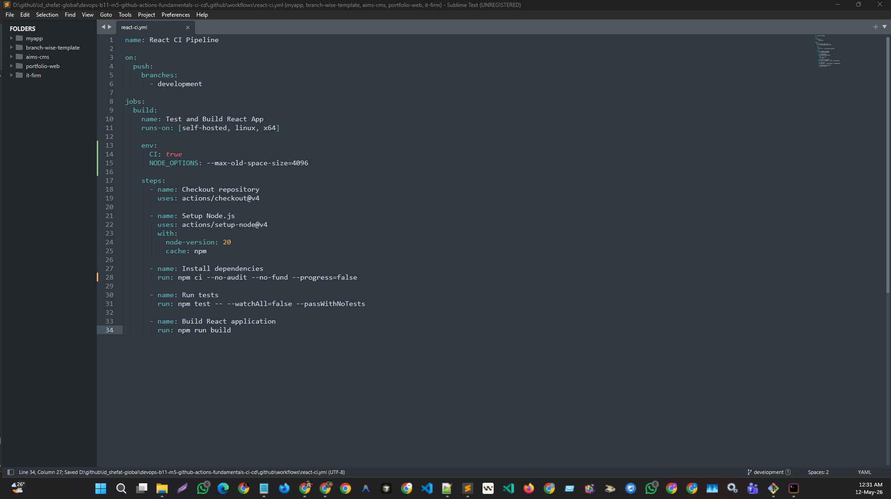

---

## Failed Pipeline Debugging Screenshot

The following screenshot shows the failed pipeline/debugging process where the workflow failed due to memory-related issues.

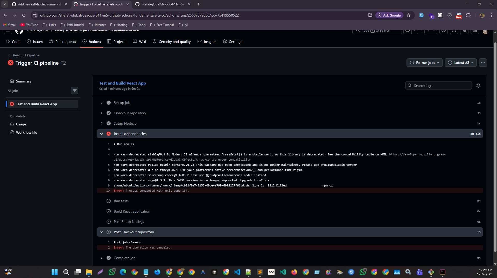

---

## Additional Screenshots

The following screenshots show different stages of the assignment, including runner setup, workflow execution, debugging, and successful pipeline completion.

### Screenshot 1

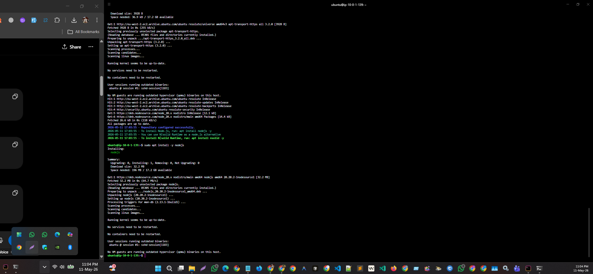

### Screenshot 2

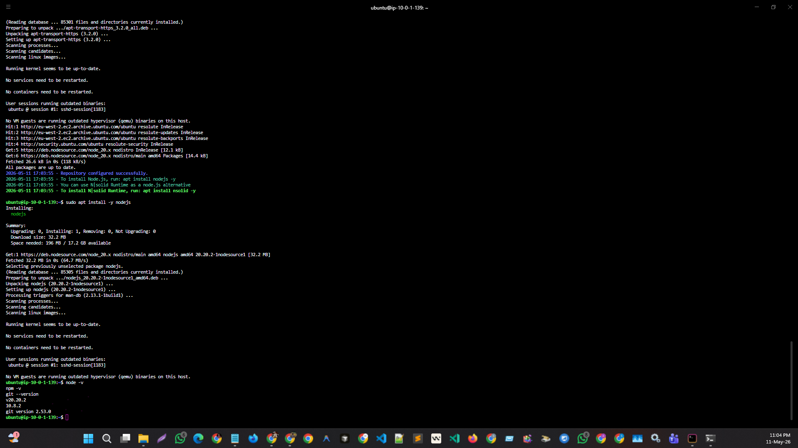

### Screenshot 3

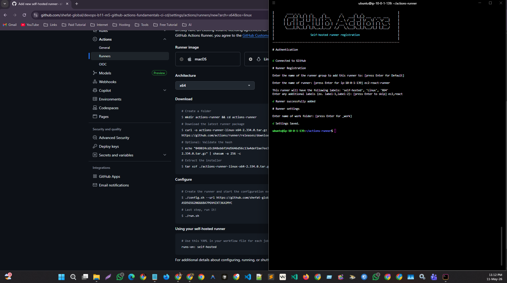

### Screenshot 4

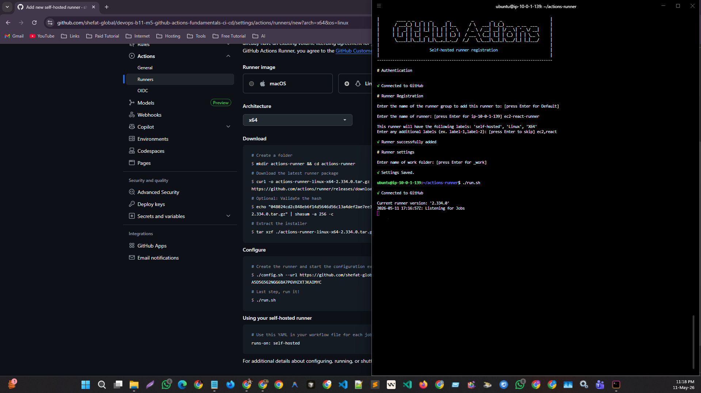

### Screenshot 5

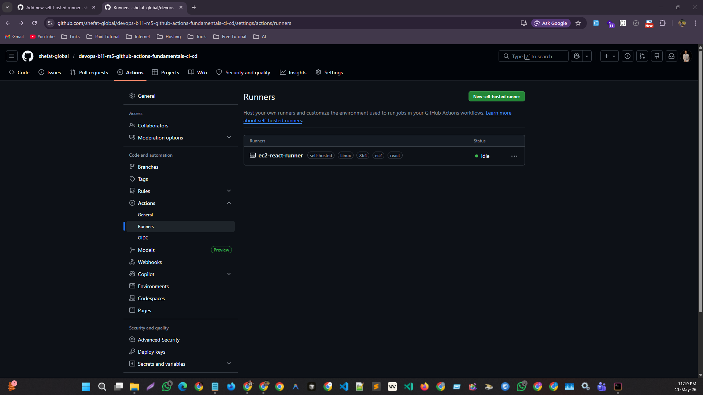

### Screenshot 6

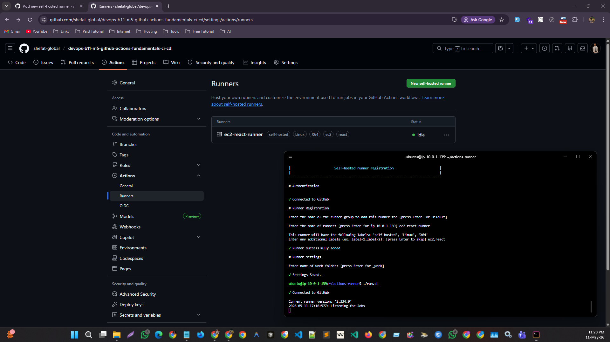

### Screenshot 7

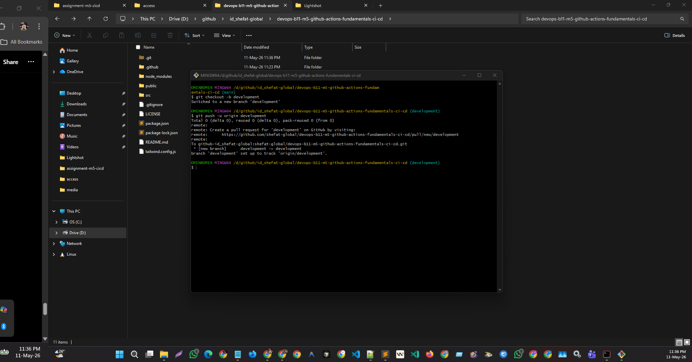

### Screenshot 8

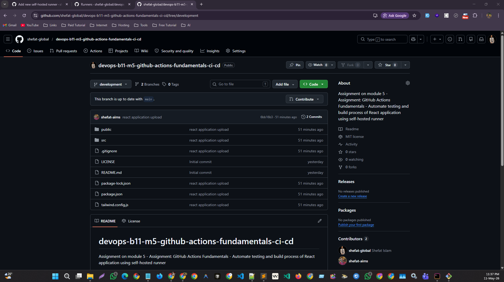

### Screenshot 9

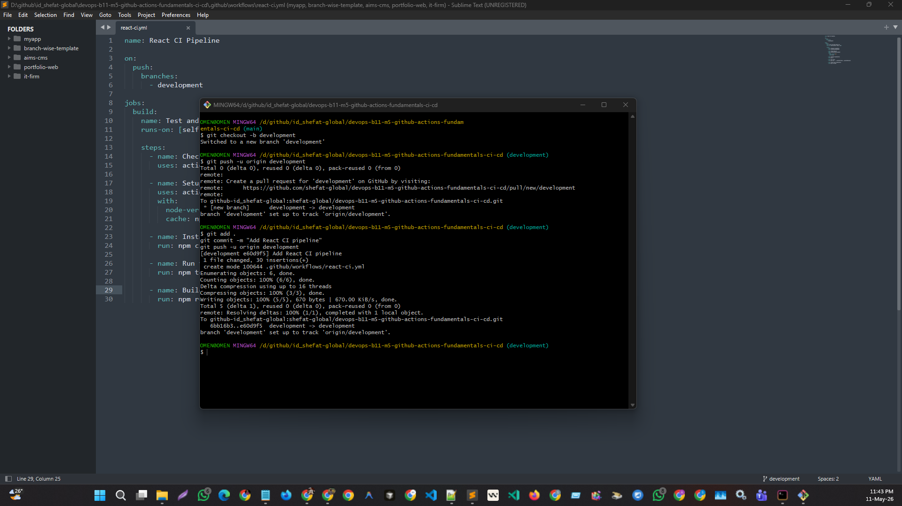

### Screenshot 10

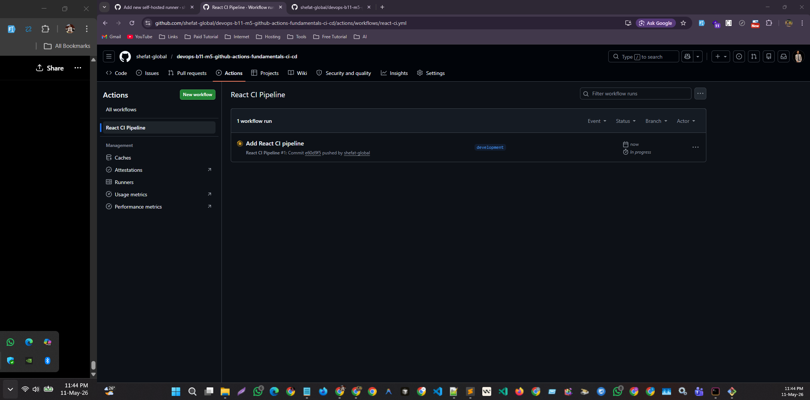

### Screenshot 11

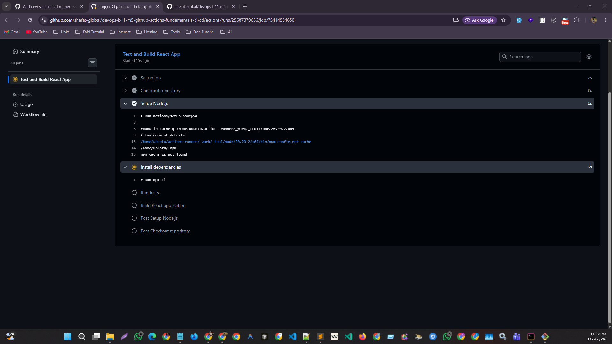

### Screenshot 12

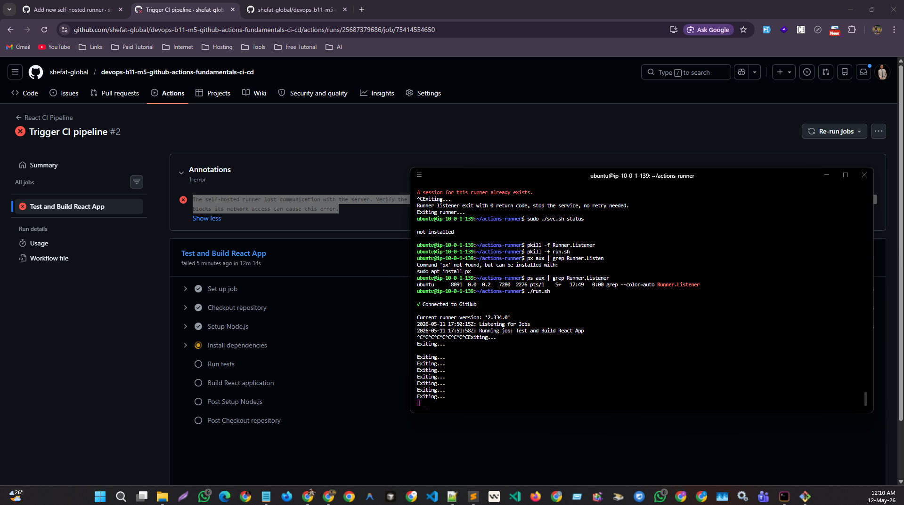

### Screenshot 13

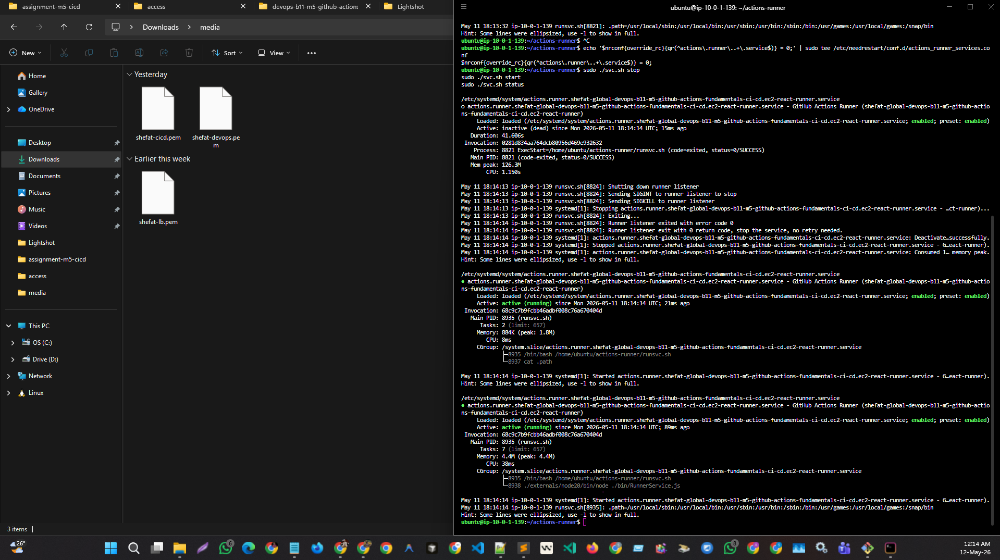

### Screenshot 14

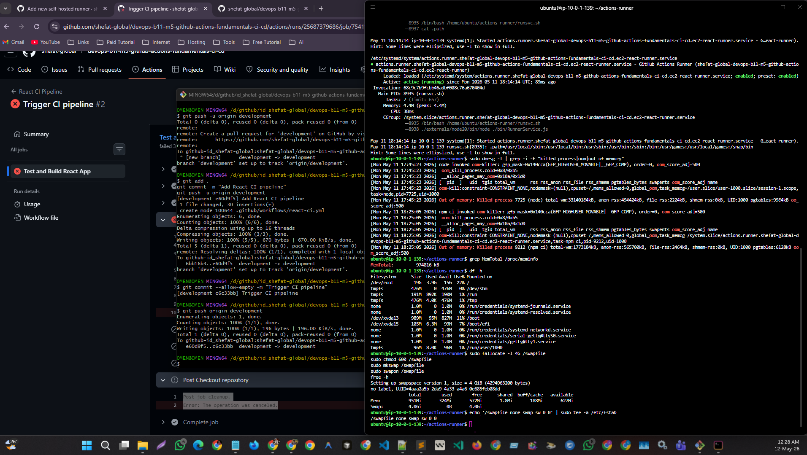

### Screenshot 15


### Screenshot 16


---

## Final Outcome

After completing the assignment:

- The React application repository was connected with GitHub Actions.
- A `development` branch was used for workflow triggering.
- An AWS EC2 Ubuntu instance was configured as a self-hosted runner.
- The workflow ran automatically after pushing code to the `development` branch.
- The pipeline installed dependencies, ran tests, and built the React application.
- Pipeline failure was identified and debugged using workflow logs and runner service logs.
- The final pipeline execution was successful.

---

## Conclusion

In this assignment, I learned how to create a CI pipeline using GitHub Actions and how to use an AWS EC2 instance as a self-hosted runner.

The CI pipeline successfully automated the testing and build process of a React application. I also learned how to debug pipeline failures using GitHub Actions logs and EC2 runner service logs.

This assignment helped me understand the practical use of:

- CI/CD
- GitHub Actions
- Workflow
- Jobs
- Steps
- Runners
- YAML workflow structure
- Self-hosted runner usage
- Pipeline debugging
